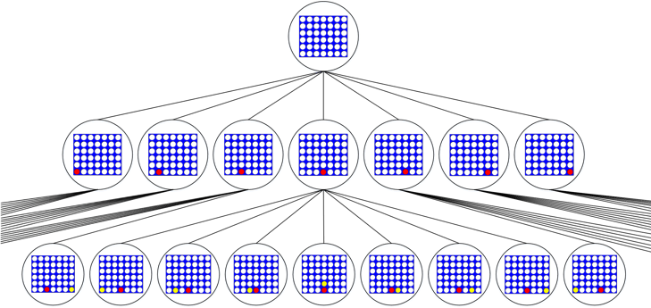
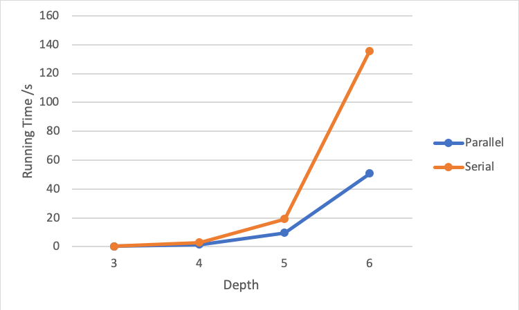

# Connect Four Minimax Agent with Alpha-Beta Pruning

### Abstract—Intelligent agents are autonomously acting entities that take inputs from their environment and act rationally on its environment based on those inputs [1]. For this project, we implemented an autonomous agent that could play the board game Connect Four and reliably win or tie the game a majority of the time. We used the Minimax algorithm with alpha-beta pruning for determining the behavior of the agent. In order to see how effective our agent was, we tested it against an artificial intelligence agent found online and compiled the data from various matches.

### Keywords—minimax, alpha-beta pruning, connect four, artificial intelligence

## I.	Introduction

Connect Four is a two player game which consists of a vertical board of six rows by seven columns. Each player has 21 pieces of the same color and they take turns to drop a piece in one of the seven columns. The piece will drop down to the lowest unoccupied row. A player wins when they manage to get four consecutive pieces of the same color either horizontal, vertical or diagonally. The game of Connect Four was solved by Victor Allis and described in his 1988 paper [2]. It is an adversarial, zero-sum game. In this paper, it was proven that the first player can always win if he plays the center column first. Although the game is deterministic, it would require 4 terabytes of memory to keep all possible legal board combinations. Some more practical methods to implement a Connect Four agent include:
Minimax with Alpha-Beta pruning: a backtracking algorithm used to find the best move in a game. The agent attempts to either choose moves that maximize its score or minimize its opponent’s score. The value of moves is given by a heuristic [2]. Alpha-Beta serves as an optimization of Minimax that keeps track of a global maximum or global minimum and ignores certain branches based on the global maximum or minimum in order to speed up the time taken to process the game tree [3].
Artificial neural networks: Neural networks such as AlphaGo have shown to be very effective at learning how to play games [4]. However, neural networks require a learning period which may require a lot of data of completed games (for supervised learning) or to play against a human or another agent for a long time in order to improve performance.
Monte Carlo tree search: Monte Carlo starts off similar to Minimax by selecting best move till a certain depth. After it reaches the cutoff It will run a large number of random scenarios and propagate the results backwards in order to choose the best path. The cut off for this algorithm could be a specified length of time to run the computations or a certain number of explored scenarios [5].
Considering the advantages and disadvantages of each, it was ultimately decided to use the Minimax with Alpha-Beta pruning over the other two, primarily, because we wanted to put the topics covered in class into practice. However, since Connect Four has a considerably sized game tree, the Minimax algorithm implemented will have a depth cutoff in order to effectively run the experiment in any computer. In the following sections we will explain how our Minimax algorithm functions and the hardware it was running on; we describe the tests made to assess the performance of the agent; and Finally,  we analyze the compiled data in order to determine whether our agent is capable and reached our expectations.

## II.	Description of AI Agent

The Minimax function we implemented was based on the default pseudocode of the algorithm [6]. The basic function of the algorithm is to look a certain number of moves ahead in the game tree and choosing the branch that leads it to the most profitable node. The first thing, the algorithm checks is whether the current board or node is a terminal board, or if it has reached maximum depth. A terminal board is a board where the game has ended either by a player winning or no more spaces being available and the game is a tie. In the case that the current board is terminal, if the agent was the winner, then it returns a large score as its value, if the opposing player was the winner, the it returns a large negative score to discourage the agent from choosing that path. In the case that the maximum depth node was reached it returns a score determined by the implemented heuristic. If it is not yet a terminal node, it generates successor nodes based on the columns that have not yet been fully filled and calls minimax recursively for the successor board as a minimizing player and reducing the depth input by 1. This ensures that it will reach the base case of depth being zero at some point. After running minimax for all its successors, it chooses the path that led to the highest score and returns that value for the agent to act on. When called for the minimizing player, the function acts the same except it favors the path that leads to the lesser score. The reasoning for this is that Connect Four is a zero-sum game, therefore if a player incurs in a loss of a certain value, its opponent will incur in a win of an equal value, and vice versa. 
The alpha and beta values act as the best move found for the maximizing player and the minimizing player respectively. The first call of Minimax has alpha as negative infinity and beta as infinity in order to ensure that both will be updated. As soon as a node value greater than the current alpha is found, its value replaces alpha’s value. Similarly, as soon as a value lesser than current beta is found, it replaces beta’s value. When the value of beta would become lesser than the value of alpha, the loop would break and will not search the remaining successor nodes because it determines that they will not be selected regardless. This dramatically increases the time complexity of the minimax algorithm which is helpful for deeper tree traversal. 

Figure 1. Minimax game tree with and without alpha-beta pruning.

In the image above we see a demonstration of Minimax with and without alpha-beta pruning and how it makes its decisions on a simplified game tree. It is noted how alpha-beta pruning does not change the outcome, but it speeds up the processes by knowing which nodes do not need to be expanded. 
The heuristic we implemented nudged the agent into favoring the middle of the board and returned higher scores for chaining more pieces together. For example, for linking two of the agents pieces together, would return a score of 10, while linking 3 pieces together would return a 100. For middle rows, the added score was very small, only enough to be favorable if every column has the same score.
The experiments to test the running times of the agent were run on a Macbook Pro with 3.1 GHz Intel Core i5 processor and 8GB memory. It should be possible to run on other machines, since the running times were found to be very fast.

## III.	Testing and Results
	
Our agent was tested against an existing AI agent found online at https://www.gimu.org/connect-four-js/plain/alphabeta/index.html. This agent uses Minimax with alpha-beta pruning as well and has the option of choosing the cut-off depth for the game tree. At each match, the cut-off depth for both agents were set to the same number. When competing at depth of 4, the game resulted in a tie. When competing at a depth of 5, our agent won. Since the minimax algorithm is deterministic, there is no use is playing multiple times, since each time the outcome would be the same. 
Another algorithm used to compare the performance of our algorithm is the one found at https://azfour.com/. This agent uses a neural network based on AlphaZero, which was created by DeepMind [7]. It was tested against the model with 50 training generations, which is the maximum available option. There is also a setting for difficult, for which medium and hard settings were used. The difficulty setting determines how much weight will be given to each column choice. The higher the difficulty for the AlphaZero agent, the smaller the acceptance threshold and the more certain it is that a given column is the best choice. At easier levels, there is a higher chance that a suboptimal column will be chosen. Since the AlphaZero algorithm assigns a percentage to each column and the choice is made using that probability, it is not deterministic, which means we can repeat the game many times with different results. After playing 10 games with our Minimax agent versus the AlphaGo agent, the results in Table 1 were obtained.

| | Start AlphaZero | Start Minimax |
|---|---|---|
| Wins | 2 | 1 |
| Losses | 3 | 4 |

Table 1: Wins/losses of our Minimax algorithm versus AlphaZero trained for generation 50 and set to medium difficulty.

For five of the games, AlphaZero made the first move and for the other five games, our minimax agent made the first move. 
The results of the 10 matches between our agent against AlphaZero generation 50 at maximum difficulty are shown in Table 2.

| | Start AlphaZero | Start Minimax |
|---|---|---|
| Wins | 0 | 0 |
| Losses | 5 | 5 |

Table 2: Wins/losses of our Minimax algorithm versus AlphaZero trained for generation 50 and set to maximum difficulty.

We also wanted to test the effectiveness of alpha-beta pruning. An experiment was run to observe running time at various cutoff depths with and without alpha-beta pruning. Since we are only interested in observing running time, we had the agent of interest, play against the same minimax agent at cut-off depth 1, which would make rational moves very quickly but without looking ahead. In all depths from 2 to 6, the agent with the greater cut-off always beat the agent with depth 1. Also, all games were ensured to be won after having made 20 turns or more in order to have enough data points for a reliable average running time per turn.

Figure 2: Minimax algorithm running times per turn at various depths with and without alpha-beta pruning.

## IV.	Discussion

The tests and results in the previous section help us get an idea of how good our agent is at playing Connect Four. The results show that at medium level of difficulty for the AlphaZero agent, our model was able to win 30% of the time and at hard level of difficulty it won 0% of the time. Although not enough games were played to get more conclusive results, it shows that our algorithm does fairly well at obtaining an adequate column to choose at medium level. Further observation of the AlphaZero choices suggests how it fails sometimes. It was observed that the first 1-2 moves are critical to determining who will win. Although AlphaZero assigns a 61% chance of choosing the middle column on the initial turn, even though it has already been determined that the center column is always the best choice, and when playing a perfect game, the outcome of who will win is determined by who played first and whether they chose the center column. On games where the AlphaZero agent did not choose a good column to start, it would lose eventually.
Figure 2 shows how the running time of minimax is affected by the cut-off depth. Effectively, the time complexity of minimax is O(b^d) because it follows a depth first search pattern. For a branching factor of 7 and a depth of 6 it means that 117,649 different boards are explored. The speed is increased dramatically as most of the branches that are known to not lead anywhere are not explored by using alpha-beta pruning. The use of alpha-beta pruning does not sacrifice performance, as it maintains the completeness and optimality of the original minimax algorithm.

## V.	Conclusion and Future Work

Based on testing our Minimax agent on humans and against other agents online, it was found that our agent performs rationally and makes intelligent moves. When playing against intermediate human players, it would win most of the time, but it would also lose sometimes. The agent might be able to be improved, however, if it goes against a player who goes first and plays a perfect game there is no way that even the best artificial intelligence agent could win. 
Future work includes improving the score function. This could be done by experimenting with different values for 2- and 3-in-a-rows or by assigning points to known patterns that can more easily force a win based on known strategies. 
Another possible way to improve the algorithm is by ordering the game tree in a more optimal fashion. If we find the best moves early in the tree traversal, we can use alpha-beta pruning to cut the running time even further. Then a deeper search can be done by increasing the cut-off depth without having to sacrifice with running times that are too long. 
While our minimax agent could still be improved, it provides a challenge to even intermediate players, while still giving them an enjoyable experience by allowing them to win once in a while. Nobody would want to play with our agent if it won every single time!

## References

I. Rudowsky, "Intelligent Agents", Nada.kth.se, 2004. [Online]. Available: https://www.nada.kth.se/kurser/kth/2D1381/AgentOverviewRudowsky.pdf. [Accessed: 07- May- 2019]
V. Allis, "A Knowledge-Based Approach of Connect-Four", ICGA Journal, vol. 11, no. 4, pp. 165-165, 1988. Available: http://www.informatik.uni-trier.de/~fernau/DSL0607/Masterthesis-Viergewinnt.pdf. [Accessed 21 April 2019].
X. Kang, Y. Wang and Y. Hu, "Research on Different Heuristics for Minimax Algorithm Insight from Connect-4 Game", Journal of Intelligent Learning Systems and Applications, vol. 11, no. 02, pp. 15-31, 2019. Available: https://file.scirp.org/pdf/JILSA_2019030615385424.pdf. [Accessed 21 April 2019].
A. Prasad, "Lessons from AlphaZero: Connect Four", Medium, 2019. [Online]. Available: https://medium.com/oracledevs/lessons-from-alphazero-connect-four-e4a0ae82af68. [Accessed: 25- Apr- 2019].
C. Browne et al., "A Survey of Monte Carlo Tree Search Methods", IEEE TRANSACTIONS ON COMPUTATIONAL INTELLIGENCE AND AI IN GAMES, vol. 4, no. 1, 2012. Available: http://citeseerx.ist.psu.edu/viewdoc/download;jsessionid=B7BB1338BDE1F287ECFC52AD86AFD055?doi=10.1.1.297.3086&rep=rep1&type=pdf. [Accessed 25 April 2019].
S. Russell and P. Norvig, Artificial intelligence: A Modern Approach, 3rd ed. New Jersey: Prentice Hall, 2010.
A. Young, "AZFour: Connect Four Powered by the AlphaZero Algorithm", Medium, 2019. [Online]. Available: https://medium.com/@sleepsonthefloor/azfour-a-connect-four-webapp-powered-by-the-alphazero-algorithm-d0c82d6f3ae9. [Accessed: 07- May- 2019].
